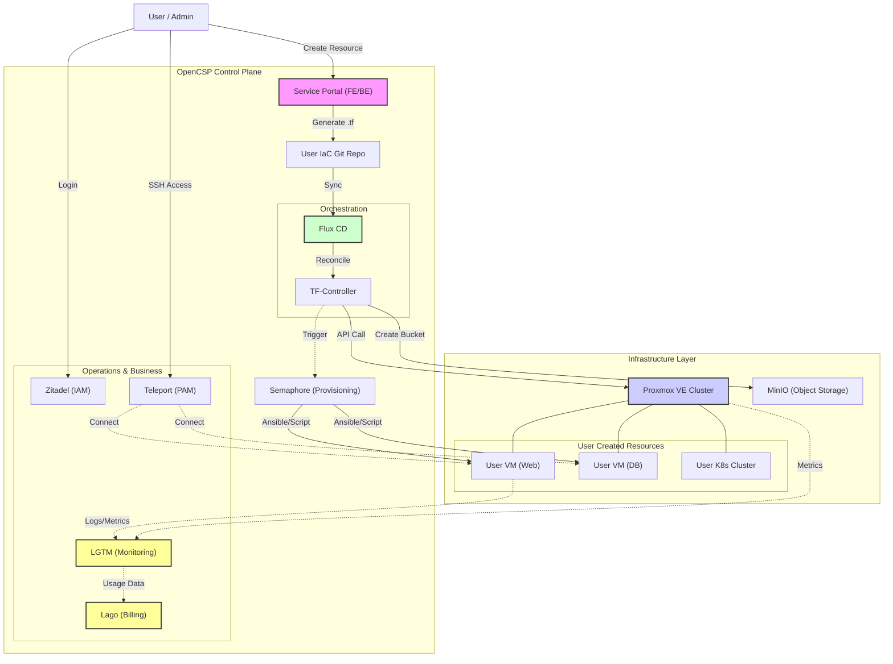

# OpenCSP: The Open-Source Cloud Builder

OpenCSP는 유휴 인프라 자원만 있다면 누구나 즉시 '클라우드 서비스 제공자(CSP)'가 될 수 있도록 돕는 올인원 클라우드 구축 솔루션입니다.

### 핵심 가치
복잡한 IDC 구축 없이 Proxmox와 최신 Cloud-Native 기술을 결합하여, Self-hosted(사내 구축형) 및 SaaS(서비스형) 형태의 퍼블릭/프라이빗 클라우드를 손쉽게 론칭할 수 있습니다.

### 기술적 특징: GitOps 기반의 자동화된 클라우드 
사용자의 모든 인프라 요청을 코드로 변환(IaC)하고, 검증된 오픈소스 도구들을 오케스트레이션하여 안정적인 서비스를 제공합니다.

**Control Plane (Core) 구성 요소:**
- Infrastructure: Proxmox VE (추후 OpenStack, K8s 지원) 기반의 가상화 환경 제공
- GitOps Engine: 사용자 요청 → Terraform Code 변환 → Flux CD를 통한 인프라 배포 자동화
- Configuration Management: Semaphore를 활용한 VM 보안 설정 및 모니터링 에이전트 자동 주입
- Security & Identity: Zitadel(IAM)을 통한 통합 인증과 Teleport(PAM)를 활용한 Bastion 없는 안전한 서버 접근
- Object Storage: AWS S3 호환 MinIO 스토리지 제공
- Monitoring: LGTM, OpenTelemetry
- Billing: Lago (Kill Bill) 연동
- Managed Services: 구축된 인프라 위에 DB, K8s Cluster, RabbitMQ 등을 원클릭으로 배포하는 PaaS 기능 내장

## 구조도 (Architecture Diagram)

