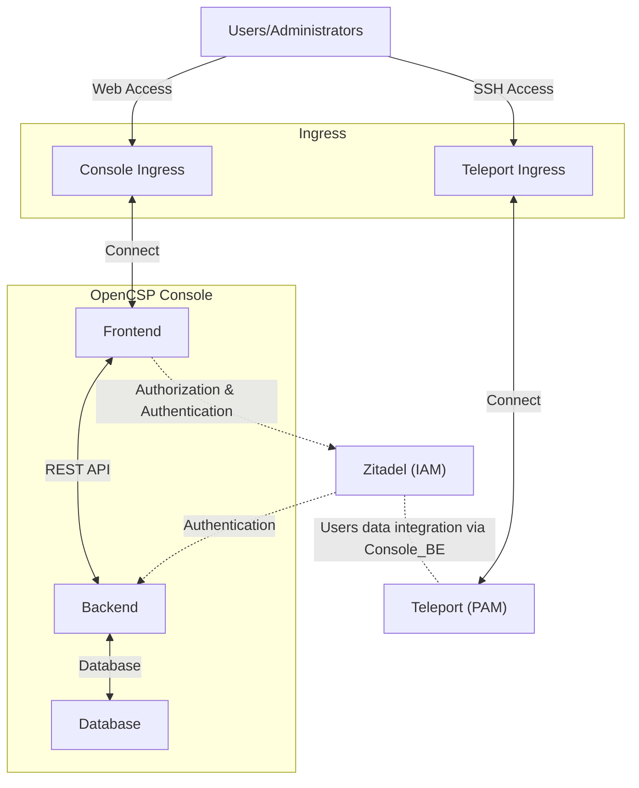

# OpenCSP Console

**OpenCSP Console** is the web portal for [OpenCSP](https://github.com/h001-lab) — an open-source platform that lets anyone run their own Cloud Service Provider (CSP) using Proxmox and cloud-native tools.

---

## Overview

OpenCSP Console serves as the central interface for managing infrastructure creation and resource access. It integrates with **Zitadel** for identity and access management, supporting external OAuth providers (e.g. Google), fine-grained role-based access control (RBAC), and just-in-time (JIT) user provisioning.

Users can request resource creation through the console, which is forwarded to the OpenCSP Core for provisioning. Progress and resource state are tracked in real time. Once provisioned, users can securely access their resources via the web console or SSH proxy (Teleport).

---

## Tech Stack

| Layer | Technology |
|-------|-----------|
| Frontend | Next.js 15, TypeScript, Zustand, Tailwind CSS |
| Backend | Spring Boot 3.5, Java 21, Spring Security (JWT Resource Server) |
| IAM | Zitadel (OIDC / OAuth2) |
| PAM | Teleport (SSH proxy) |
| Database | H2/SQLite (dev), PostgreSQL / MariaDB (prod) |
| i18n | Custom message broker (en / ko / jp) |

---

## Architecture


```mermaid
flowchart TD
    User["Users/Administrators"]
    Zitadel["Zitadel (IAM)"]
    Teleport["Teleport (PAM)"]

    subgraph OpenCSP_Console ["OpenCSP Console"]
        Console_FE["Frontend"]
        Console_BE["Backend"]
        Console_DB["Database"]

        Console_FE <-->|REST API| Console_BE
        Console_BE <-->|Database| Console_DB
    end

    subgraph Ingress ["Ingress"]
        TeleportIngress["Teleport Ingress"]
        ConsoleIngress["Console Ingress"]
    end

    TeleportIngress <-->|Connect| Teleport
    ConsoleIngress <-->|Connect| Console_FE

    Console_FE -.->|Authorization & Authentication| Zitadel
    Zitadel -.->|Authentication| Console_BE
    Zitadel -.-|Users data integration via Console_BE| Teleport

    User -->|Web Access| ConsoleIngress
    User -->|SSH Access| TeleportIngress
```

---

## Getting Started

### Prerequisites

- Node.js 20+, npm
- Java 21, Gradle

### Frontend

```bash
cd fe
npm install
cp .env.example .env.local   # fill in values
npm run dev                  # http://localhost:3000
```

### Backend

```bash
cd be
cp .env.sample .env          # fill in values
./gradlew bootRun            # http://localhost:8080
```

---

## Environment Variables

### Frontend (`fe/.env.local`)

| Variable | Required | Description |
|----------|----------|-------------|
| `NEXTAUTH_URL` | Yes | Public URL of the frontend (e.g. `http://localhost:3000`) |
| `AUTH_SECRET` | Yes | NextAuth secret — generate with `openssl rand -base64 32` |
| `ZITADEL_ISSUER` | Yes | Zitadel issuer URL (e.g. `https://auth.example.com`) |
| `ZITADEL_CLIENT_ID` | Yes | OAuth2 client ID |
| `ZITADEL_CLIENT_SECRET` | No | OAuth2 client secret (required if Zitadel app uses secret) |
| `ZITADEL_PROJECT_ID` | No | Zitadel project ID (for audience scope) |
| `NEXT_PUBLIC_SITE_URL` | Yes | Same as `NEXTAUTH_URL` (exposed to browser) |
| `NEXT_PUBLIC_BE_WS_URL` | No | WebSocket base URL for terminal console (e.g. `ws://localhost:8080`) |
| `BACKEND_URL` | Yes | Internal URL of the Spring backend (server-side only) |

### Backend (`be/.env`)

| Variable | Default | Description |
|----------|---------|-------------|
| `APP_IAM_PROVIDER` | `none` | IAM provider: `none` (dev) or `zitadel` (prod) |
| `APP_CONFIG_ENCRYPTION_KEY` | `opencsp-dev-key!` | AES encryption key for DB-stored secrets (16+ chars) |
| `APP_K8S_ENABLED` | `false` | Enable Kubernetes provisioning client |
| `APP_K8S_API_SERVER` | — | K8s API server URL (e.g. `https://192.168.0.100:6443`) |
| `APP_K8S_TOKEN` | — | K8s service account Bearer token |
| `ZITADEL_ISSUER_URI` | — | Zitadel OIDC issuer URI |
| `ZITADEL_CLIENT_ID` | — | OAuth2 client ID |
| `ZITADEL_CLIENT_SECRET` | — | OAuth2 client secret |
| `ZITADEL_DOMAIN` | — | Zitadel domain (protocol optional) |
| `ZITADEL_ORG_ID` | — | Zitadel organization ID |
| `ZITADEL_PROJECT_ID` | — | Zitadel project ID |
| `ZITADEL_SERVICE_TOKEN` | — | Service account token for Zitadel Management API |
| `SPRING_DATASOURCE_URL` | H2 file | JDBC URL — see `.env.sample` for SQLite/MariaDB/PostgreSQL examples |
| `SPRING_DATASOURCE_USERNAME` | `sa` | DB username |
| `SPRING_DATASOURCE_PASSWORD` | — | DB password |

---

## CI

CI runs on PRs to `main` via `.github/workflows/ci.yaml`. It detects which sub-project changed and runs only the relevant pipeline:

- **Frontend**: `npm run lint` + `npm run build`
- **Backend**: `./gradlew build` (tests run against H2 in-memory DB)

---

## Contributing

Contributions are welcome! Please open an issue or PR. For larger changes, open an issue first to discuss the design.

---

## License

This project is open source. See [LICENSE](./LICENSE) for details.
