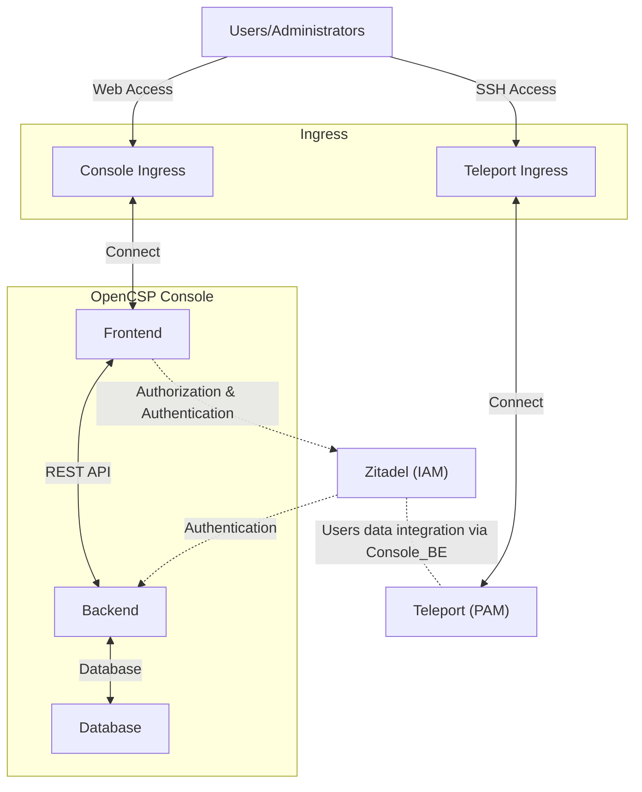

# OpenCSP Console

**OpenCSP Console** is the web portal for [OpenCSP](https://github.com/h001-lab) — an open-source platform that lets anyone run their own Cloud Service Provider (CSP) using Proxmox and cloud-native tools.

---

## Overview

OpenCSP Console serves as the central interface for managing infrastructure creation and resource access. It integrates with **Zitadel** for identity and access management, supporting external OAuth providers (e.g. Google), fine-grained role-based access control (RBAC), and just-in-time (JIT) user provisioning.

Users can request resource creation through the console, which is forwarded to the OpenCSP Core for provisioning. Progress and resource state are tracked in real time. Once provisioned, users can securely access their resources via the web console or SSH proxy (Teleport).

---

## Tech Stack

| Layer | Technology |
|-------|-----------|
| Frontend | Next.js 15, TypeScript, Zustand, Tailwind CSS |
| Backend | Spring Boot 3.5, Java 21, Spring Security (JWT Resource Server) |
| IAM | Zitadel (OIDC / OAuth2) |
| PAM | Teleport (SSH proxy) |
| Database | H2 (dev), PostgreSQL (prod) |
| i18n | Custom message broker (en / ko / jp) |

---

## Frontend

- Built with **Next.js 15** and **Zustand** for state management.
- All pages are scoped under `[locale]/` to support internationalization (`en`, `ko`, `jp`; default: `en`). Messages are loaded at runtime from `public/messages/{locale}.json`.
- UI components are based on a custom Tailwind CSS package: [hwan001/UI](https://github.com/hwan001/UI).
- Authentication is handled via **NextAuth** with the built-in Zitadel OIDC provider. The session is synced into Zustand via `AuthProvider`.

### Key Frontend Files

| File | Purpose |
|------|---------|
| `fe/src/lib/auth.ts` | NextAuth config — Zitadel OIDC, token refresh, role extraction |
| `fe/src/lib/zitadel-client.ts` | Direct Zitadel Management API client |
| `fe/src/stores/authStore.ts` | Zustand auth state store |
| `fe/src/providers/AuthProvider.tsx` | Syncs NextAuth session → Zustand |
| `fe/src/proxy.ts` | Middleware for locale detection and redirect |

---

## Backend

- Built with **Spring Boot 3.5** and **Java 21**, following **Domain-Driven Design (DDD)** principles.
- Stateless JWT Resource Server — Spring Security validates tokens issued by Zitadel, maps roles to `GrantedAuthority`, and enforces access with `@PreAuthorize`.
- JIT provisioning: `JITUserProvisioningHandler` creates a local user record on first OAuth2 login.

### Package Structure

```
io.hlab.OpenConsole/
  api/            # REST controllers + request/response DTOs
  application/    # Service layer (business logic)
  domain/         # JPA entities + repository interfaces
  infrastructure/
    config/       # OpenAPI / Swagger config
    iam/          # IAM abstraction + Zitadel implementation
    persistence/  # Spring Data JPA repository implementations
    security/     # SecurityConfig, JWT extraction, JIT provisioning
```

### Key Backend Files

| File | Purpose |
|------|---------|
| `infrastructure/security/SecurityConfig.java` | Spring Security filter chain, JWT role extraction |
| `infrastructure/security/JITUserProvisioningHandler.java` | Creates local user on first OAuth2 login |
| `infrastructure/iam/zitadel/ZitadelClient.java` | Zitadel Management API calls |
| `infrastructure/iam/IamRole.java` | Supported roles: `admin`, `userA`, `userB`, `userC` |

---

## Architecture


```mermaid
flowchart TD
    User["Users/Administrators"]
    Zitadel["Zitadel (IAM)"]
    Teleport["Teleport (PAM)"]

    subgraph OpenCSP_Console ["OpenCSP Console"]
        Console_FE["Frontend"]
        Console_BE["Backend"]
        Console_DB["Database"]

        Console_FE <-->|REST API| Console_BE
        Console_BE <-->|Database| Console_DB
    end

    subgraph Ingress ["Ingress"]
        TeleportIngress["Teleport Ingress"]
        ConsoleIngress["Console Ingress"]
    end

    TeleportIngress <-->|Connect| Teleport
    ConsoleIngress <-->|Connect| Console_FE

    Console_FE -.->|Authorization & Authentication| Zitadel
    Zitadel -.->|Authentication| Console_BE
    Zitadel -.-|Users data integration via Console_BE| Teleport

    User -->|Web Access| ConsoleIngress
    User -->|SSH Access| TeleportIngress
```

---

## Getting Started

### Prerequisites

- Node.js 20+, npm
- Java 21, Gradle
- A running Zitadel instance (for auth)

### Frontend

```bash
cd fe
npm install
cp .env.local.example .env.local  # fill in your Zitadel credentials
npm run dev
```

### Backend

```bash
cd be
cp .env.example .env  # fill in your Zitadel and DB credentials
./gradlew bootRun
```

### Environment Variables

**Frontend (`fe/.env.local`)**

| Variable | Description |
|----------|-------------|
| `ZITADEL_ISSUER` | Your Zitadel issuer URL |
| `ZITADEL_CLIENT_ID` | OAuth2 client ID |
| `AUTH_SECRET` | NextAuth secret (random string) |
| `NEXT_PUBLIC_SITE_URL` | Public URL of the frontend (e.g. `http://localhost:3000`) |

**Backend (`be/.env`)**

| Variable | Description |
|----------|-------------|
| `ZITADEL_ISSUER_URI` | Zitadel OIDC issuer URI |
| `ZITADEL_CLIENT_ID` | OAuth2 client ID |
| `ZITADEL_CLIENT_SECRET` | OAuth2 client secret |
| `ZITADEL_DOMAIN` | Your Zitadel domain |
| `ZITADEL_ORG_ID` | Zitadel organization ID |
| `ZITADEL_PROJECT_ID` | Zitadel project ID |
| `ZITADEL_SERVICE_TOKEN` | Service account token for Management API |
| `SPRING_DATASOURCE_URL` | JDBC URL (defaults to H2 in-memory if unset) |
| `SPRING_DATASOURCE_USERNAME` | DB username |
| `SPRING_DATASOURCE_PASSWORD` | DB password |

---

## CI

CI runs on PRs to `main` via `.github/workflows/ci.yaml`. It detects which sub-project changed and runs only the relevant pipeline:

- **Frontend**: lint + build
- **Backend**: `./gradlew build` (tests run against H2 in-memory DB)

---

## Contributing

Contributions are welcome! Please open an issue or PR. For larger changes, open an issue first to discuss the design.

---

## License

This project is open source. See [LICENSE](./LICENSE) for details.
